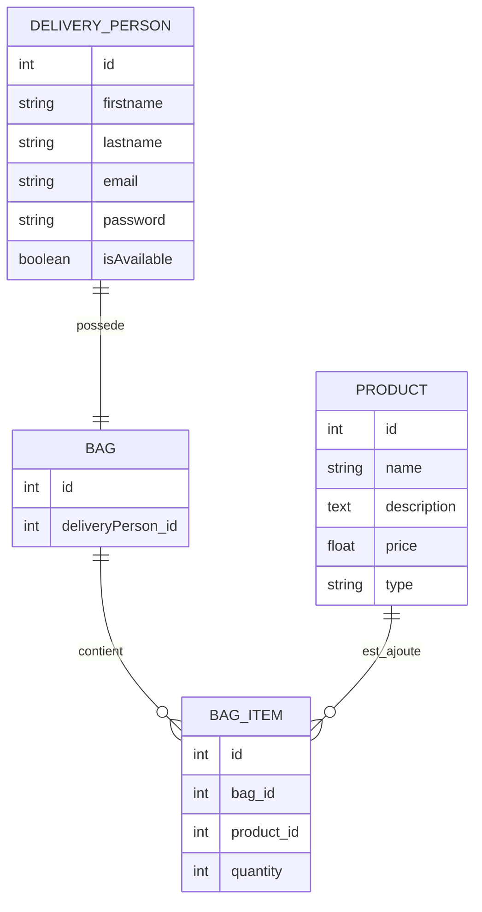

# MCD - City Lunch API

Ce document présente le modèle conceptuel de données utilisé pour les produits, les livreurs et les sacs.

## Entités

### Product

Un produit représente un plat ou un dessert préparé par City Lunch.

| Champ | Type | Rôle |
| --- | --- | --- |
| id | integer | Identifiant unique du produit |
| name | string | Nom du produit |
| description | text | Description du produit |
| price | float | Prix du produit |
| type | string | Type du produit : `plat` ou `dessert` |

### DeliveryPerson

Un livreur représente une personne qui livre les commandes.

| Champ | Type | Rôle |
| --- | --- | --- |
| id | integer | Identifiant unique du livreur |
| firstname | string | Prénom du livreur |
| lastname | string | Nom du livreur |
| email | string | Email utilisé pour la connexion |
| password | string | Mot de passe hashé |
| isAvailable | boolean | Indique si le livreur est disponible |

### Bag

Un sac appartient à un livreur.

Il contient les produits que le livreur transporte pendant son service.

| Champ | Type | Rôle |
| --- | --- | --- |
| id | integer | Identifiant unique du sac |
| deliveryPerson | relation | Livreur propriétaire du sac |

### BagItem

Une ligne de sac indique quel produit est dans le sac et en quelle quantité.

| Champ | Type | Rôle |
| --- | --- | --- |
| id | integer | Identifiant unique de la ligne |
| bag | relation | Sac concerné |
| product | relation | Produit concerné |
| quantity | integer | Quantité du produit dans le sac |

## Relations

- Un livreur possède un seul sac.
- Un sac appartient à un seul livreur.
- Un sac contient plusieurs lignes de sac.
- Une ligne de sac appartient à un seul sac.
- Une ligne de sac concerne un seul produit.
- Un produit peut être présent dans plusieurs sacs.

## Schéma simple

```txt
DeliveryPerson (1) --- (1) Bag
Bag (1) --- (N) BagItem
Product (1) --- (N) BagItem
```

## Schéma Mermaid


